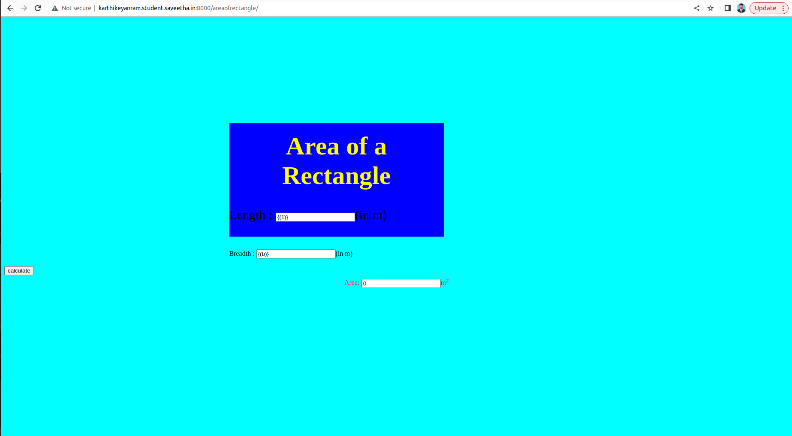

# Design a Website for Server Side Processing

# AIM:

To design a website to perform mathematical calculations in server side.

# DESIGN STEPS:

## Step 1:
create a server_side folder


## Step 2:
create mathhtml and templates folder


## Step 3:
create python program in mathhtml

## Step 4:
create python programs for views and urls.


## Step 5:
create a HTML file of forms.


# PROGRAM:
```<html>
    <head>
        <meta charset="utf-8">
        <meta http-equiv="x-ua-compatible" content='IE=edge'>
<title>Area of Rectangle</title> 
<meta name = "viewport" content='width=device-width, initial-scale=1'>
<style>
body{
    background-color: cyan;
}       
.edge {
    width: 1081px;
    margin-left: auto;
    margin-right: auto;
    padding-top: 200px;
    padding-left: 300px;
}
.box {
    display:block:
    border:thick dashed lime;
    width: 500px;
    font-size: 30px;
    background-color:BLUE;
}
.formarea{
    color:Red;
    text-align: center;
    margin-top: 5px;
    margin-bottom: 5px;

}
h1{
    color:yellow;
    text-align: center;
    padding-top: 20px;
}
</style>
</head>
<body1>
    <div class="edge">
        <div class="box">
            <h1>Area of a Rectangle</h1>
            <form method='Post'>
                
                <div class="formlen">
                    Length : <input type="text" name="length" value="{(1)}"></input>(in m)</div><br/>
                </div>
                <div class="formbred">
                    Breadth : <input type="text" name="breadth" value="{(b)}"></input>(in m)</div><br/>
                </div>
                <div class="formsub">
                    <input type="submit" value="calculate"></input><br/>
                </div>
                <div class="formarea">
                    Area: <input type="text" name="area" value="{{area}}"></input>m<sup>2</sup><br/>
                </div>
            </form>
        </div>
    </body>
    </html>


           
    </div>
</body1>
```

# OUTPUT:


# RESULT:

The program is executed succesfully
